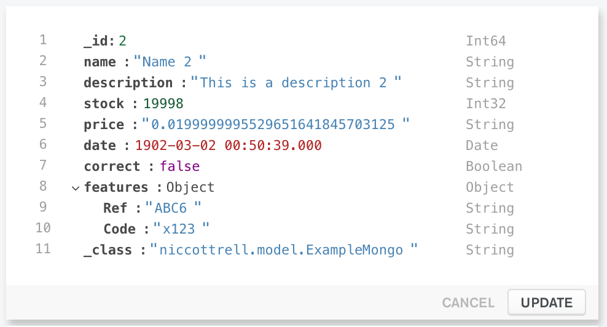
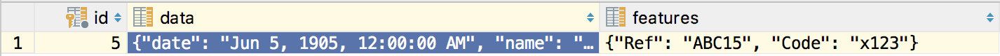

# mongodb-vs-postgresql-jsonb

The goal of this POC was to test the implementation and performance of storing JSON data in Postgrsql 9.4+ vs using native JSON structures in MongoDB.

We generate 10k documents in both MongoDB and Postgresql using Spring Boot + JPA + Hibernate and add appropriate indexes. 

## Getting started

1. Install local Postgres (with database "postgres")
1. Install local MongoDB (with database "PgPerf")
1. Run `mvn compile` to build QueryDSL sources
1. Run `mvn test` to run performance tests

## Results

### Example data

In MongoDB, documents look like:



In Postgresql, rows look like:



# Conclusions

## Disadvantages

### Constraints/Validation

While PostgreSQL JSONB type provides flexibility, it should be used just when appropriate. The only check being performed is that stored data is actually in a valid JSON format. You cannot impose any other constraints as with regular columns - such as not null or enforce a particular Data Type (Integer, VarChar, Date). Therefore it is best suited for providing an additional optional set of data to an entity, where you cannot be sure before which data is would contain. And such data would differ a lot among each of the rows. Such example can be a user-provided set of additional data. You should always carefully consider which data is better suited as regular columns and which should be stored as JSON.

### Range queries

```EXPLAIN SELECT *
   FROM example
   WHERE to_date(data->>'date', 'YYYY-MM-DD') 
       BETWEEN '2018-02-01' 
       AND     '2020-03-01'
   AND data->>'name' = 'Name 7';
```

### Compound queries

`WHERE DATE > ? AND FEATURES.Ref = ?`

# Acknowledgements

Some code forked from https://www.vojtechruzicka.com/postgresqls-jsonb-type-mapping-using-hibernate/

Some interesting articles:
* https://blog.anayrat.info/en/2017/11/26/postgresql---jsonb-and-statistics/
